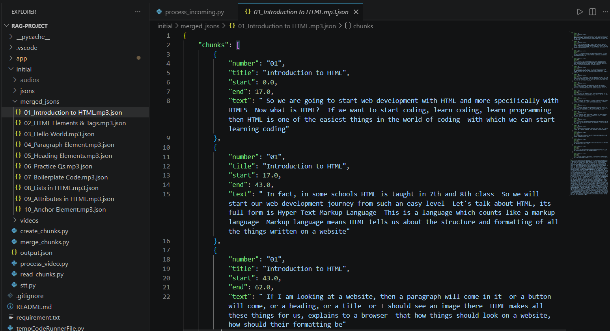
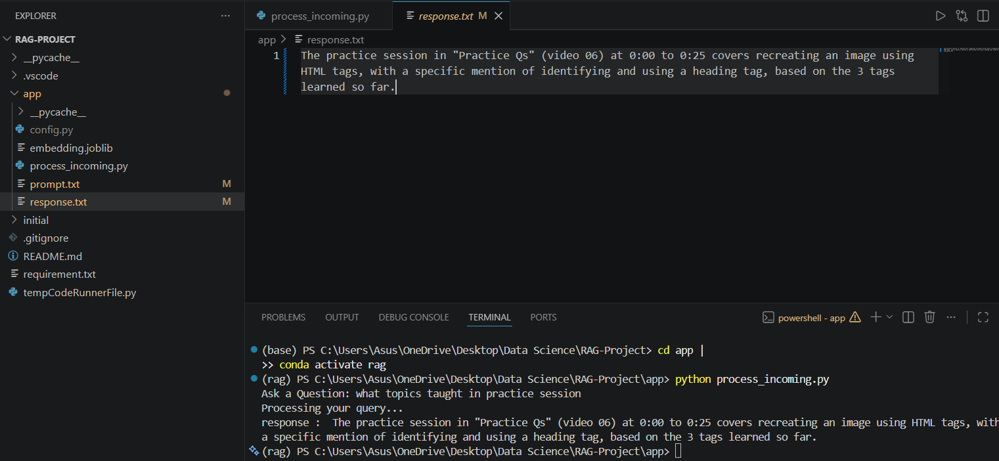
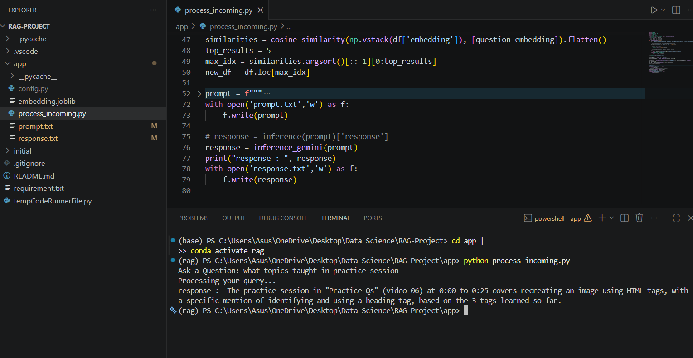

# Screenshots

## Chunk Generation Output

<p align="center">
  
</p>

---

## Retrieved AI Response

<p align="center">
  
</p>

---

## Inference Pipeline

<p align="center">
  
</p>

---

# Folder Structure

```text
RAG-PROJECT/
│
├── app/
│   ├── __pycache__/
│   ├── config.py
│   ├── embedding.joblib
│   ├── external_videos.json
│   ├── flask_app.py
│   ├── process_incoming.py
│   ├── prompt.txt
│   ├── response.txt
│   └── templates/
│       └── index.html
│
├── assets/
│   ├── inference.png
│   ├── Sample_Chunks.png
│   └── Saved_response.png
│
├── initial/
│   ├── audios/
│   ├── jsons/
│   ├── merged_jsons/
│   ├── videos/
│   ├── create_chunks.py
│   ├── merge_chunks.py
│   ├── output.json
│   ├── process_video.py
│   ├── read_chunks.py
│   └── stt.py
│
├── .gitignore
├── Procfile
├── README.md
├── requirements.txt
└── tempCodeRunnerFile.py
```

---

# How to Use This RAG AI Teaching Assistant

This project allows you to build an AI-powered semantic search assistant for educational videos using Retrieval-Augmented Generation (RAG), embeddings, and Large Language Models (LLMs).

The system processes course videos, generates subtitle embeddings, retrieves semantically relevant chunks, and answers user queries with contextual timestamps and explanations.

## Two Local Usage Modes

You can run the RAG pipeline locally in two ways. Both modes require the local embedding server (default endpoint: `http://localhost:11434/api/embed`) to be running.

1) Flask web interface (interactive)

- Start the web UI:

```bash
python app/flask_app.py
```

- Open the app in your browser at `http://127.0.0.1:5000`.
- Use the prompt form in the web UI to send queries to the RAG pipeline and view responses. This mode is best for exploration and manual testing.

2) Terminal / script mode (direct pipeline run)

- Run the inference script directly:

```bash
python app/process_incoming.py
```

- This executes the RAG inference flow without the web UI. The script reads the pipeline inputs (for example `app/prompt.txt`) and writes outputs to `app/response.txt`.
- Use this mode for automation, debugging, or non-interactive processing.

# Installation & Setup

## 1. Clone the Repository

```bash
git clone https://github.com/Sajid-1101/RAG-Based---AI-Teaching-Assistant.git
cd RAG-PROJECT
````

---
## 2. Create Virtual Environment (Recommended)

### Windows

```bash
python -m venv venv
venv\Scripts\activate
```

### Linux / macOS

```bash
python3 -m venv venv
source venv/bin/activate
```

---

## 3. Install Dependencies

```bash
pip install -r requirements.txt
```

---

## 4. Install Ollama

Download and install Ollama from:

https://ollama.com

Start Ollama with the local server:

```bash
ollama serve
```

---

## 5. Pull Required Models

The `bge-m3` model is required for embedding user prompts and query vectors. The `llama3.2` model is used for text generation.

```bash
ollama pull bge-m3
ollama pull llama3.2
```

If you are only using the embedding endpoint, `bge-m3` is the critical model for prompt embedding.

---

## 6. Configure API Keys (Optional)

If using Gemini API:

Create a `.env` file or update `config.py` with:

```python
GEMINI_API_KEY = "your_api_key"
```

---

## 7. Run the Flask App Locally

Start the Flask web interface with:

```bash
python app/flask_app.py
```

Then open this address in your browser:

```text
http://127.0.0.1:5000
```

If your virtual environment is active and Ollama is running locally, the app should load in the browser and display the prompt form plus sample video links.

---

## 8. You're Ready to Run the Pipeline

Continue with the steps below.

---

# Workflow

```text
Videos
   ↓
Audio Extraction
   ↓
Whisper Transcription
   ↓
Chunk Generation
   ↓
Chunk Merging
   ↓
Embedding Creation
   ↓
Vector Similarity Search
   ↓
Prompt Augmentation
   ↓
LLM Response Generation
```

---

# Step 1 — Add Your Videos

Move all lecture/course videos into:

```text
initial/videos/
```

Example:

```text
01_Introduction.mp4
02_HTML_Basics.mp4
03_Paragraph_Tags.mp4
```

---

# Step 2 — Convert Videos to Audio

Run:

```bash
python initial/process_video.py
```

This extracts audio files into:

```text
initial/audios/
```

---

# Step 3 — Generate Subtitle Chunks

Run:

```bash
python initial/create_chunks.py
```

This step:

* transcribes audio using Whisper
* creates subtitle chunks
* stores timestamps and metadata

Generated JSON files are stored in:

```text
initial/jsons/
```

---

# Step 4 — Merge Chunks

Run:

```bash
python initial/merge_chunks.py
```

This step:

* merges related subtitle chunks
* improves semantic retrieval quality
* prepares optimized chunk structures

Merged files are stored in:

```text
initial/merged_jsons/
```

---

# Step 5 — Generate Embeddings

Run:

```bash
python initial/read_chunks.py
```

This step:

* loads merged chunks
* generates embeddings using `bge-m3`
* stores vector embeddings

Generated vector file:

```text
app/embedding.joblib
```

---

# Step 6 — Run the RAG Inference Pipeline

Run:

```bash
python app/process_incoming.py
```

The system:

1. receives a user query
2. generates query embeddings
3. performs cosine similarity retrieval
4. retrieves relevant chunks
5. augments the prompt
6. sends context to the selected LLM
7. generates contextual responses with timestamps

```
```
